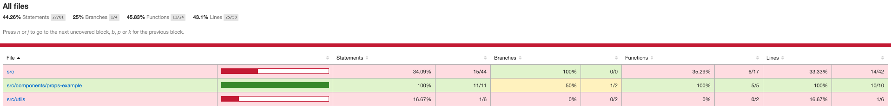
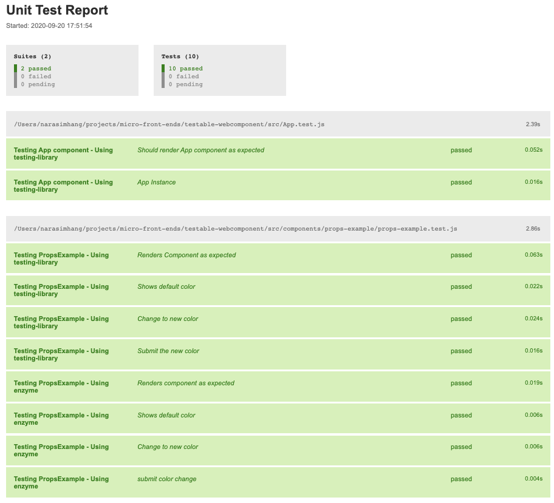
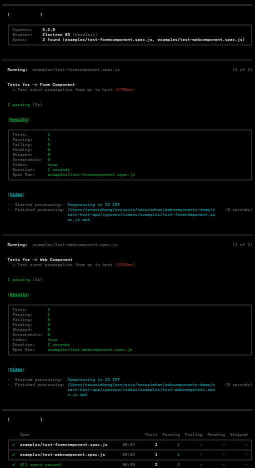

# webcomponents-demo
This project uses web-react-components libary to convert react project to web-component.

Unit tests are run using Jest and are written using react testing library and enzyme.

Integration tests are written and run using cypress automation framework.

### Build Web-Components
```sh build.sh```

This creates js files in dist directory for each webcomponent we are exporting.

#### Running Unit tests for webcomponents
```
cd testable-webcomponent
npm test
```
We can find the test results under test-result directory and coverage report under coverage directory




Start Web Server
```
brew update
brew install nginx
```
Edit vi /usr/local/etc/nginx/nginx.conf to locate dist directory of webcomponents
```
location ~* \.(js|jpg|png|css)$ {
    root <path/to/cloned_location>/micro-front-ends/testable-webcomponent/dist;
}
```        

### Run Host App
```
cd react-host-app
npm install
npm start
```
#### Run integration tests (Testing web-component from host project)
```
npm run it-test
```

